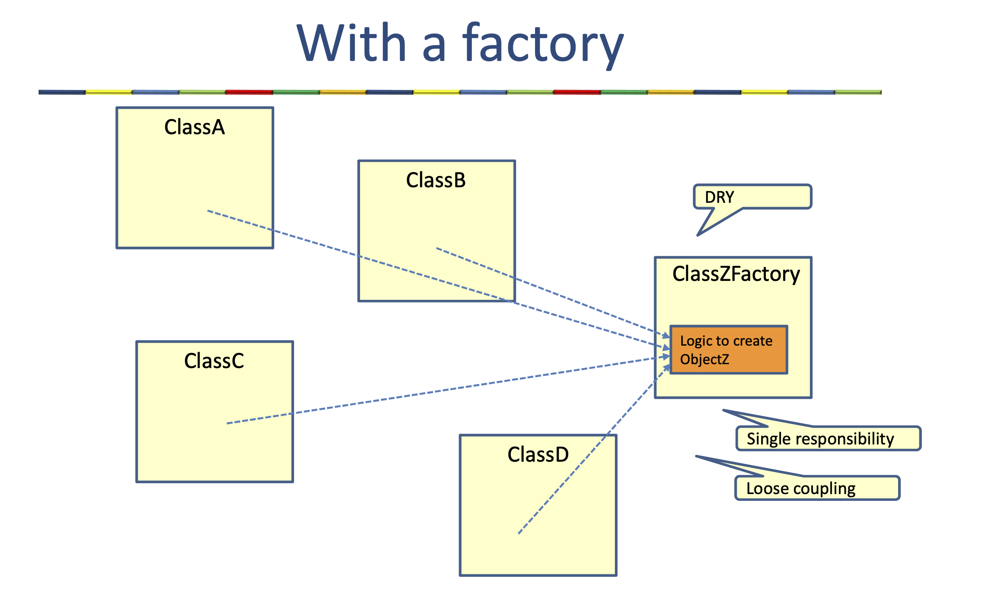
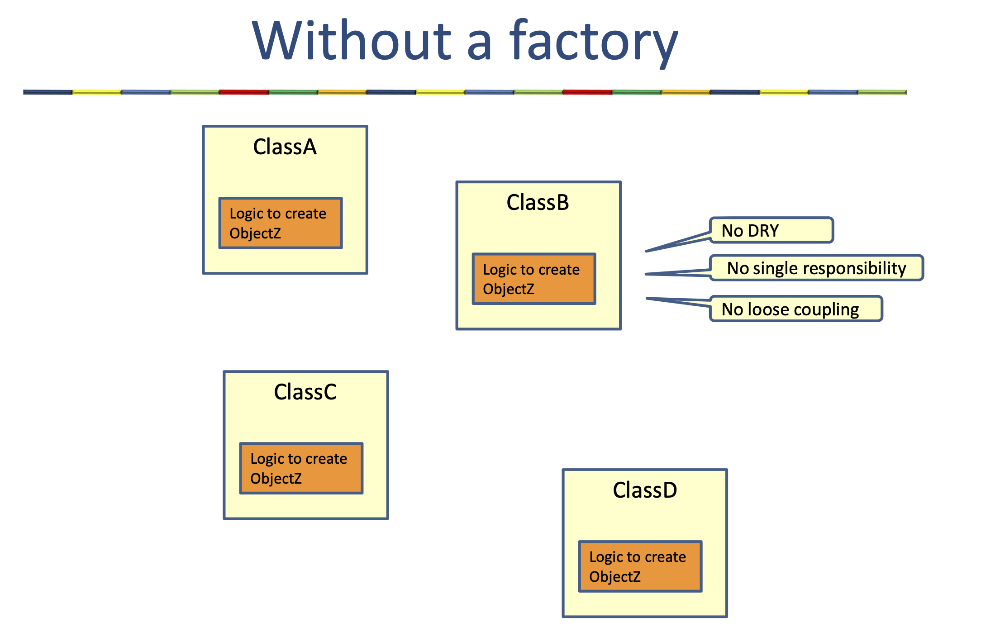
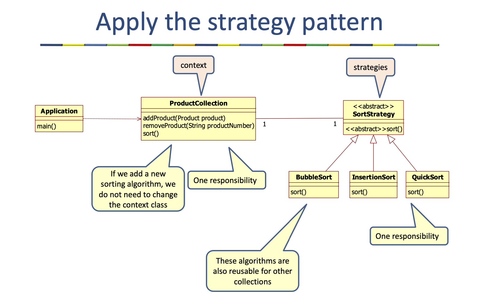

# Table of Contents

1. [Design Principles](#design-principles)
2. [Singleton Pattern](#singleton-pattern)

   - [Eager Instantiation](#eager)
   - [Lazy Instantiation](#lazy)

3. [Builder Pattern](#builder-pattern)

4. [Facade Pattern](#facade-pattern)

5. [Factory Pattern](#factory-pattern)

6. [Strategy Pattern](#strategy-pattern)

---

# Design Principles

- Keep it simple
- Keep it flexible
- Loose coupling
- Separation of concern
- Information hiding
- Principle of modularity
- DRY: Don’t repeat yourself
- Encapsulate what varies
- Solid
- Single Responsibility Principle (SRP)
- Open-Closed Principle (OCP)
- Liskov Substitution Principle (LSP)
- Interface Segregation Principle (ISP)
- Dependency Inversion Principle (DIP)

---

# Singleton pattern

Singleton is a very simple pattern, just have one object instance.

**Implementation:**

    1. Make the constructor private.
    2. Declare a private static instance of the class.
    3. Add a static method to get an instance of the singleton class.

    some example of singleton: Connection Pool, PrinterBuffer and Cache.


With singleton we often share the resources but making or instantiating shared resources , reading something from a property file, creating database connection takes a lot of time. so we two options with singleton 1. Eager Instantiation 2. Lazy Instantiation.

### Eager

We create connection pool in the beginning before even calling static method .

```java
public class ConnectionPool {
​//declare a private static instance of a class
private static ConnectionPool pool=new ConnectionPool();
//this is a pool with only one connection
private Connection connection=new Connection();

private ConnectionPool() {}
//add a static method to get an instance of a singleton class
public static ConnectionPool getPool() {
​return pool;
​}
public Connection getConnection() {
​return connection;
}
}
```

### Lazy:

Whenever we call method than we create a connection pool. Most often this we use.

```java
public class ConnectionPool {
private static ConnectionPool pool;
//this is a pool with only one connection
private Connection connection=new Connection();
private ConnectionPool() {}
//add a static method to get an instance of a singleton class
public static ConnectionPool getPool() {
​if(pool==null) {
​​pool=new ConnectionPool(); //lazy instantiation
​}
​}
public Connection getConnection() {
​return connection;
}

}
```

---

# Builder Pattern

- Builds a complex object using step by step approach. This pattern is helpful while creating objects with many different parameters.
- If we want Expressive code and Immutable class
  - solution: Bulilder pattern

---

# Facade Pattern

The facade pattern provides a unified interface to a complex set of classes. It hides the complexity from the clients.

---

# Factory Pattern

A factory creates objects

- Encapsulation of the logic to create objects




#### Different types of factories:

- Simple factory method
  - Static or not static
- Factory method pattern
- Abstract factory pattern

---

# Strategy Pattern

The strategy pattern extracts algorithms (strategies) from a certain class (context class) and makes a different class for every single algorithm. This gives the following advantages

- We can easily add new algorithms without changing the context class
- The strategies are better reusable


