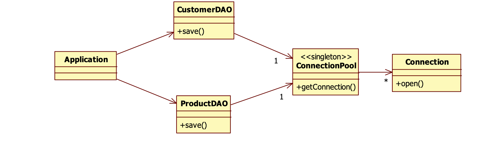

# Singleton pattern

        => Singleton is a very simple pattern, just have one object instance.

        Implementation:

    1. Make the constructor private.
    2. Declare a private static instance of the class.
    3. Add a static method to get an instance of the singleton class.

    some example of singleton: Connection Pool, PrinterBuffer and Cache.

With singleton we often share the resources but making or instantiating shared resources , reading something from a property file, creating database connection takes a lot of time. so we two options with singleton 1. Eager Instantiation 2. Lazy Instantiation.

Eager:
We create connection pool in the beginning before even calling static method .
public class ConnectionPool {
​//declare a private static instance of a class
private static ConnectionPool pool=new ConnectionPool();
//this is a pool with only one connection
private Connection connection=new Connection();
private ConnectionPool() {}
//add a static method to get an instance of a singleton class
public static ConnectionPool getPool() {
​return pool;
​}
public Connection getConnection() {
​return connection;
}
}

Lazy:
Whenever we call method than we create a connection pool. Most often this we use.

public class ConnectionPool {
private static ConnectionPool pool;
//this is a pool with only one connection
private Connection connection=new Connection();
private ConnectionPool() {}
//add a static method to get an instance of a singleton class
public static ConnectionPool getPool() {
​if(pool==null) {
​​pool=new ConnectionPool(); //lazy instantiation
​}
​}
public Connection getConnection() {
​return connection;
}

}

# Builder Pattern
